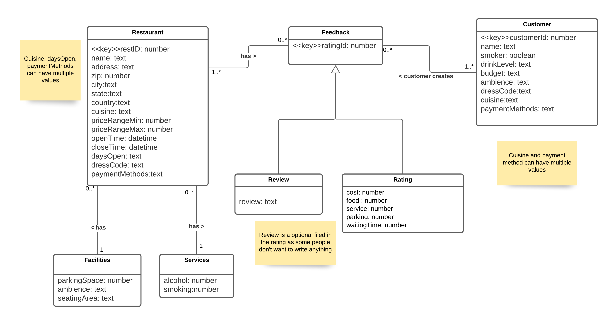
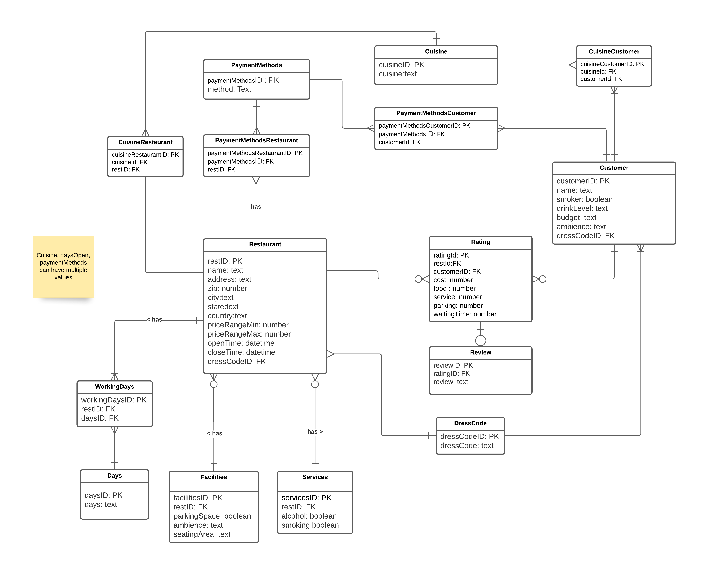

# CS5200-Project-III RestaurantReview Management
Project 3 / Design & Implement a Key-Value In-Memory Database

## Overview of Project
In this practicum you will modify the database you built for previous projects to adjust them to a key-value in-memory database (Redis). You can reuse the project description, selecting one data structure that makes sense to be implemented as an in-memory store. Finally you will modify your existing codebase to make it work with Node and Redis.

## Format
This work should be completed individually

## Tasks
(15 pts) Provide the problem requirements and the conceptual model in UML for your project. You can reuse the one made on previous projects, but describe the functionalities that you selected to be used as an in-memory key-value storage, (e.g. most viewed products, a shopping cart, current logged-in users, etc).

(25 pts) Describe the Redis data structures that you are going to use to implement the functionalities you described in the previous point. (e.g. To implement the most viewed products I will use a Redis sorted set with key "mostViewed:userId", product ids as the values and a score of the number of views of the product.). You can use/describe more than one data structure, you will need to implement at least one.

(60 pts) Create a basic Node + Express application that let's you create, display, modify and delete at least one Redis data structure from the ones describe in the previous point. No need to have a polished interface, and you can use the code created in class as a starting point, and/or the code you created for previous projects

# Project proposal

@Misha Mody, and I will be adding new features to our project 3 Restaurant - Review Management System.

My split would be:
Adding a caching layer to the application that caches reviews/restaurant details for a certain amount of time. We will apply CRUD operations to this data.

@Misha Mody  will be working on:
- Converting the restaurant table from mongoDB to redis DB
- CRUD operations on the Restaurant Table 
- Query/filter restaurants based on cuisines
- Leaderboard for restaurants with the highest reviews

# Installation

1) Clone the repository 
2) Move to the folder named "app"
3) `npm install`
4) `npm start`
5) goto  http://localhost:2000/restaurants  to view the project

# Conceptual Model:

# logical Model:

# Data used:

- [Rating database dump](./db/rating.json)
- [Restaurant database dump](./db/restaurant.json)

# Data-Structure Used:
- 

# Installation & Loading data:

1) Clone the repository 
2) Move to the folder named "app"
3) `npm install`
4) Move back to the root folder of the project

Load Mongo data:

1) Start by running mongodb locally
2) Create new database called `restaurant-reviews`
3) create 2 new collections called `restaurantDB` and `Rating`
4) import [restaurantDB](./db/restaurant.json) to the `restaurantDB` collection
4) import [Rating](./db/rating.json) to the `Rating` collection

Load Redis data:

1) Start redis-server locally
2) Move to folder `app` to install the dependencies using `npm install`
3) run the file [convertData](./app/MongoToRedisData) `node MongoToRedisData/convertData.js`

Start application:

1) `npm start`
2) goto  http://localhost:2000/  to view the project

# Made by
https://github.com/Misha-Mody

https://github.com/emile-f
